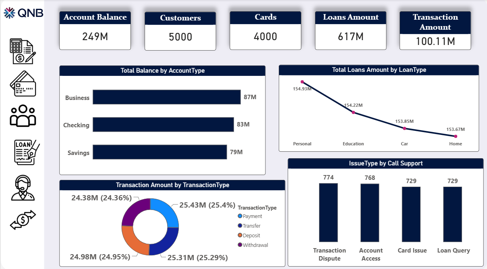
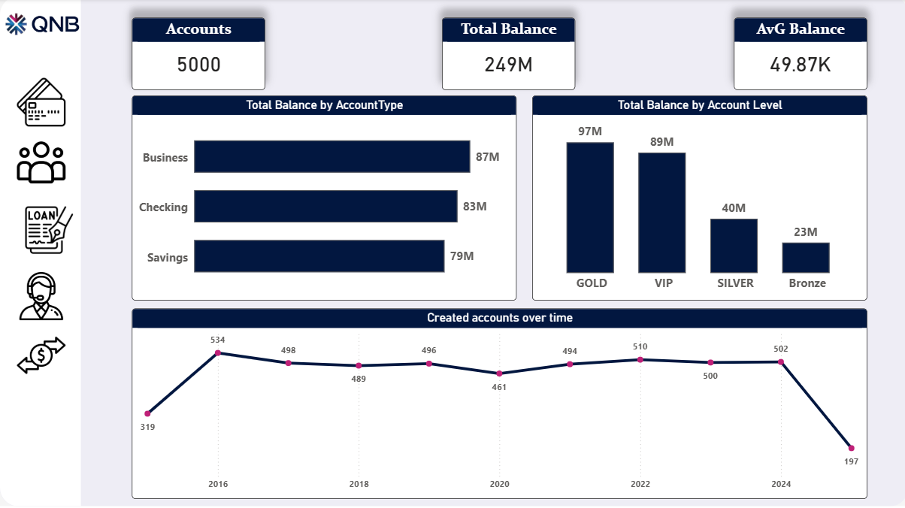
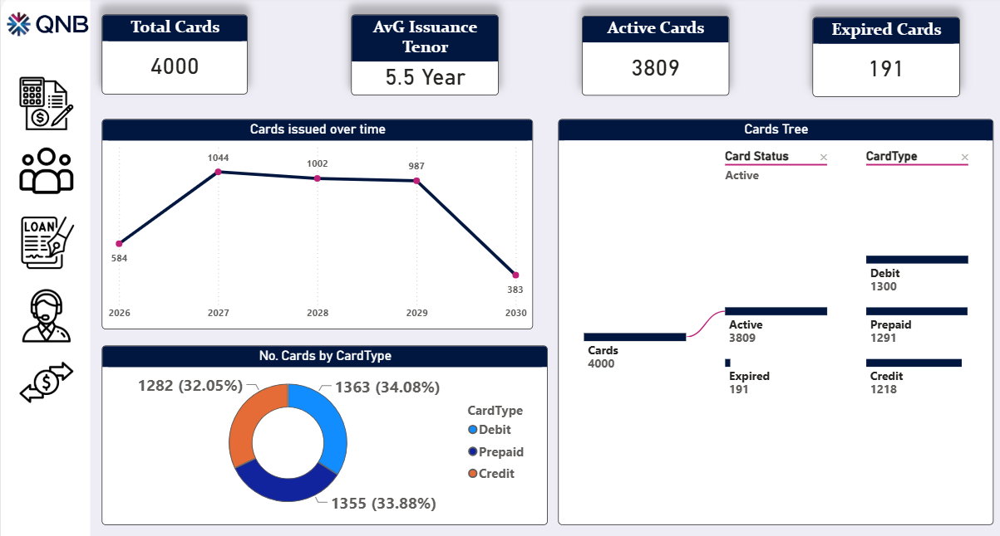
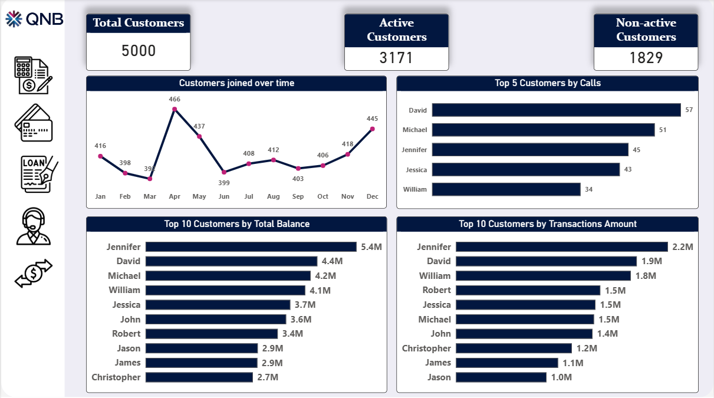
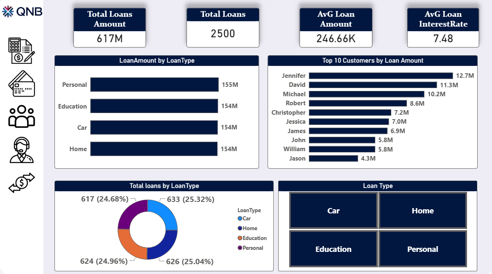
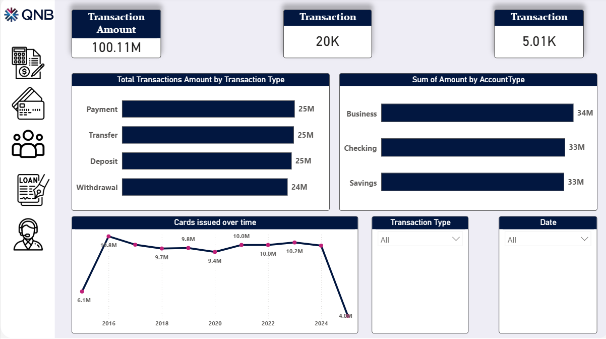

# Corporate-Banking-performance-Dashboard

## Project Overview
This project delivers a enterprise-level multi-page Power BI dashboard designed to evaluate core banking operations, customer account balances, loan portfolios, credit/debit card distributions, and customer support ticket resolutions for QNB. Built through structured data transformation and interactive DAX modeling, this dashboard translates high-volume banking transactions into actionable strategic insights.

---

## Key Insights & Metrics
- **Financial & Portfolio Volume:** Evaluated **$249M** in total account balances across **5,000 customers**, with *Business accounts* leading total reserves (**$87M**).
- **Loan Portfolio Health:** Monitored **$617M** in total loans (**2,500 accounts**) across Personal, Education, Car, and Home categories, with an average interest rate of **7.48%**.
- **Card Issuance & Lifecycle:** Tracks **4,000 total cards** with an active status rate of **95.2%** (**3,809 active cards** vs. 191 expired) across Debit, Prepaid, and Credit formats.
- **Customer Support Operations:** Analyzed **3,000 support calls**, identifying *Transaction Disputes* (**774 calls**) and *Account Access* (**768 calls**) as primary volume drivers, with a **49.3% resolution rate**.
- **Transactional Throughput:** Processed **20K transactions** totaling **$100.11M**, maintaining a balanced distribution across Payments, Transfers, Deposits, and Withdrawals.

---

## Tools & Techniques Used
- **Power BI Desktop:** End-to-end data modeling, DAX measure creation, interactive visualizations, and navigational bookmarks.
- **Power Query:** Extraction, Transformation, and Loading (ETL), data cleaning, column profiling, and type validation.
- **DAX (Data Analysis Expressions):** Calculated measures for financial KPIs (*Total Balances, Average Tenure, Active vs. Non-Active Customers, Resolution Percentages*).
- **UI/UX Optimization:** Clean corporate design with consistent branding, custom KPI header cards, interactive slicers, and seamless navigation.

---

## Dashboard Preview

| Home Page | Overview |
|---|---|
|  |  |

| Accounts | Cards |
|---|---|
|  |  |

| Customers | Loans |
|---|---|
|  |  |

| Support Calls | Transactions |
|---|---|
|  |  |

---

## Project Files & Dataset
- **[Download Power BI Dashboard (Corporate%20Banking%20Performance%20Dashboard.pbix)](#)** *(Full interactive dashboard & data model)*

> **Note:** This project is a simulated case study for analytical and portfolio purposes using dummy data. It is not affiliated with or endorsed by QNB.
